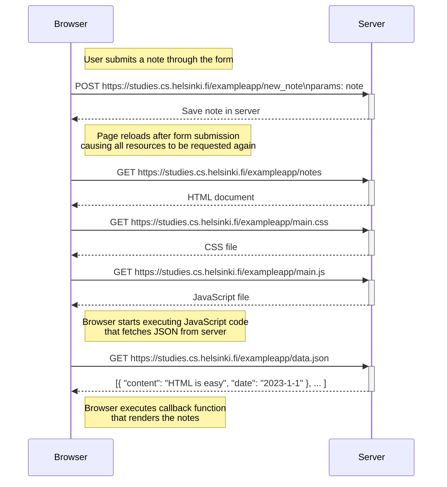

```mermaid
sequenceDiagram
    participant Browser
    participant Server

    Note right of Browser: User submits a note through the form
    Browser->>+Server: POST https://studies.cs.helsinki.fi/exampleapp/new_note\nparams: note
    Server-->>-Browser: Save note in server

    Note right of Browser: Page reloads after form submission<br>causing all resources to be requested again
    Browser->>+Server: GET https://studies.cs.helsinki.fi/exampleapp/notes
    Server-->>-Browser: HTML document

    Browser->>+Server: GET https://studies.cs.helsinki.fi/exampleapp/main.css
    Server-->>-Browser: CSS file

    Browser->>+Server: GET https://studies.cs.helsinki.fi/exampleapp/main.js
    Server-->>-Browser: JavaScript file

    Note right of Browser: Browser starts executing JavaScript code<br>that fetches JSON from server

    Browser->>+Server: GET https://studies.cs.helsinki.fi/exampleapp/data.json
    Server-->>-Browser: [{ "content": "HTML is easy", "date": "2023-1-1" }, ... ]

    Note right of Browser: Browser executes callback function<br>that renders the notes


```
